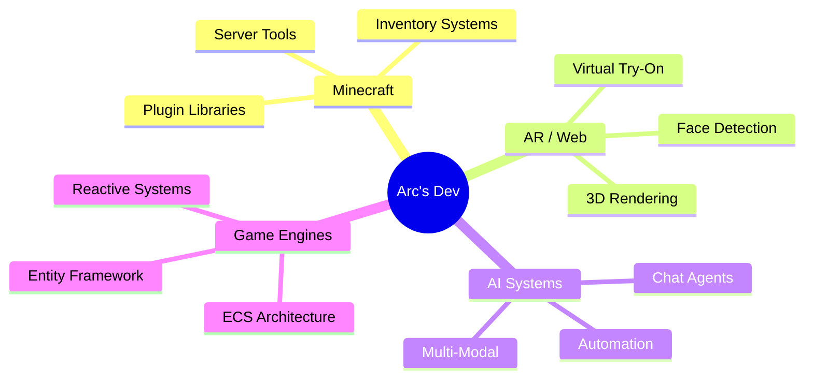

<div align="center">


[](https://git.io/typing-svg)

[](https://hits.seeyoufarm.com)

</div>

---

## 🧑‍💻 About Me

```kotlin
data class Developer(
    val name: String = "Arc",
    val focus: List<String> = listOf(
        "Minecraft Plugin Development",
        "Game Engine Architecture",
        "AI & Automation",
        "AR / Computer Vision"
    ),
    val loves: List<String> = listOf("☕ Kotlin", "🎮 Gaming", "🏗️ Building Systems"),
    val motto: String = "복잡한 것을 단순하게, 단순한 것을 아름답게"
)
```

- 🔭 **Currently working on:** Minecraft plugin ecosystems & AR web apps
- 🌱 **Learning:** Advanced Kotlin coroutines, WebGL/Three.js, AI agent systems
- 🎯 **Goal:** Build tools that make other developers' lives easier
- 📫 **Reach me:** [GitHub Issues](https://github.com/atozuser0224) or Discussions

---

## 🛠️ Tech Stack

### Languages


### Frameworks & Libraries


### Tools


---

## 📊 GitHub Stats

<div align="center">


</div>

---

## 🚀 Featured Projects

### 🎮 Minecraft Plugins
<p float="left">
  <a href="https://github.com/atozuser0224/InvMaker">
    
  </a>
  <a href="https://github.com/atozuser0224/Arc">
    
  </a>
  <a href="https://github.com/atozuser0224/ServerMinecraft">
    
  </a>
  <a href="https://github.com/atozuser0224/ItemBuilder">
    
  </a>
</p>

> **More Minecraft projects:** [mineFactories](https://github.com/atozuser0224/mineFactories) · [StatLib](https://github.com/atozuser0224/StatLib) · [CardSystem](https://github.com/atozuser0224/CardSystem) · [ArkLib](https://github.com/atozuser0224/ArkLib) · [EntityComponentSystemWithPaper](https://github.com/atozuser0224/EntityComponentSystemWithPaper)

### 🕶️ AR & Computer Vision
<p float="left">
  <a href="https://github.com/atozuser0224/glass-virtual-try-on">
    
  </a>
  <a href="https://github.com/atozuser0224/3dGlass">
    
  </a>
</p>

> 🌐 **Live demo:** [glass-virtual-try-on](https://atozuser0224.github.io/glass-virtual-try-on/) &mdash; Try virtual glasses on your face in real-time!

### 🤖 AI & Agents
<p float="left">
  <a href="https://github.com/atozuser0224/AiChatAssist">
    
  </a>
  <a href="https://github.com/atozuser0224/LoadForBlind">
    
  </a>
</p>

> More: [MoAgent](https://github.com/atozuser0224/MoAgent) · [Body_Detection_Ui_System](https://github.com/atozuser0224/Body_Detection_Ui_System)

### 🏗️ Game Engines & Architecture
<p float="left">
  <a href="https://github.com/atozuser0224/AstarinGameEngine">
    
  </a>
  <a href="https://github.com/atozuser0224/Unity_RhythmGame">
    
  </a>
</p>

> **More engine projects:** [ArcaneRefactor](https://github.com/atozuser0224/ArcaneRefactor) · [ArcaneReactor](https://github.com/atozuser0224/ArcaneReactor) · [GameEngine2](https://github.com/atozuser0224/GameEngine2)

---

## 🎯 What I'm Building Now



---

<div align="center">

## 🤝 Let's Connect

[](https://github.com/atozuser0224)
[](https://github.com/atozuser0224)

---


<sub>Made with ❤️ by Arc | Last updated: 2026.07.02</sub>

</div>
